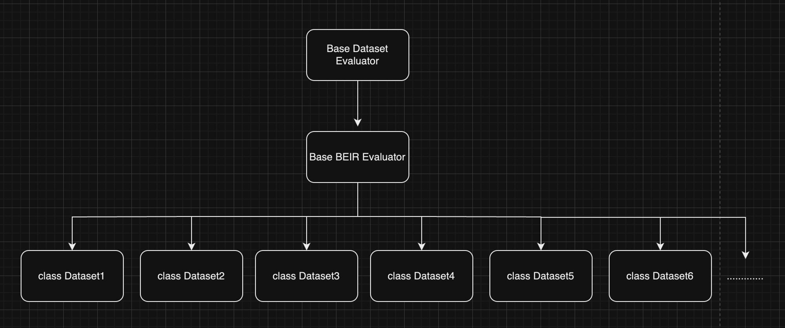

# Overview

BEIR is a heterogeneous benchmark that has been built from 18 diverse datasets representing 9 information retrieval tasks.
Using project, we use 6 datasets, FEVER, FIQA, HOTPOTQA, QUORA, SCIDOCS, and SCIFACT.
More information about beir dataset, please visit link!

[Github](https://github.com/beir-cellar/beir?tab=readme-ov-file)<br>
[Paper](https://openreview.net/forum?id=wCu6T5xFjeJ)<br>
[HuggningFace](https://huggingface.co/BeIR)

Our BEIR benchmark structure is like below picture.
Basic preprocessing process is same at 6 benchmark dataset,
so we construct preprocess, ingest, evaluation process are in BaseBeirEvaluator class.
Each evaluator class corresponding to the benchmark datasets
(FEVER, FIQA, HOTPOTQA, QUORA, SCIDOCS, and SCIFACT) inherits from the BaseBeirEvaluator.



Also, we removed non-relevant score passages at qrels.<br>

# Example Use

```Python
from RAGchain.benchmark.dataset import <your beir evaluator>

pipeline = <your pipeline>
retrievals = [<your retrieval>]
db = <your db>

evaluator = <your beir evaluator>(pipeline, evaluate_size=20)
evaluator.ingest(retrievals, db) # ingest dataset to db and retrievals
result = evaluator.evaluate()

# print result summary (mean values)
print(result.results)
# print result DataFrame
print(result.each_results)
```